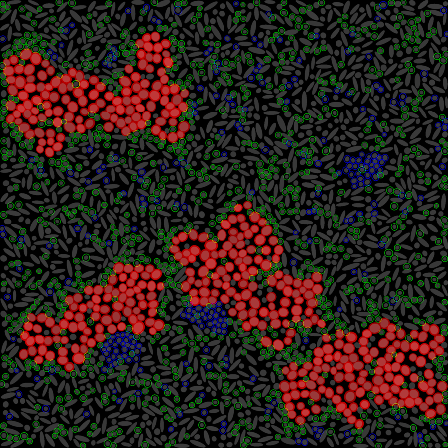

# Multiplex synthetic data

A small, **fully-labelled synthetic multiplexed-imaging dataset** -- a schematic
tissue of several cell types organised into niches -- for learning, testing, and
validating cell **clustering, phenotyping, classification, and
spatial-neighborhood analysis** in [QuPath](https://qupath.github.io/), especially
with the
[QP-CAT extension](https://github.com/uw-loci/qupath-extension-cell-analysis-tools).

## Why this exists

Tools that cluster cells, call phenotypes, and measure spatial relationships are
hard to trust on real data, because **real multiplexed tissue has no ground
truth** -- you never actually know which cell is which type, or whether two
populations really co-localize. Real datasets are also large, licensed, and
messy, which makes them a poor way to *learn* a workflow or *check that an
install works*.

This dataset is the opposite: **small, self-contained, and fully ground-truthed.**
Every cell has a known type, known marker positivity, and a known place in the
tissue, so you can run an analysis and check that it recovered the right answer.

It is deliberately built so that **every major analysis has something to
recover**:

- **Clustering / phenotyping / classification** -- six cell types, each defined
  by a distinct marker combination *and* a distinct morphology.
- **Spatial neighborhoods** -- the cells are organized into tissue niches (tumor
  nests, B-cell follicles, an immune-infiltrated nest boundary, and stroma), so
  neighborhood-enrichment, co-occurrence, Ripley, and cellular-neighborhood
  analyses produce clear, correct signals.
- **Batch correction** -- some images carry a deliberate per-image intensity
  offset, so integration methods (e.g. Harmony) have a batch effect to remove.

It is synthetic and makes no claim to biological realism beyond what is needed to
exercise these tools; it is a **test fixture and teaching aid**, not a substitute
for real data. In particular it has **no extracellular matrix / collagen and no
realistic tissue architecture** -- the "nests" and "follicles" are schematic blobs
that exist only to give the spatial analyses something to find. Adding real tissue
structure (e.g. an ECM/collagen channel, more faithful tumor architecture) is a
possible future direction, which is also why the dataset is named for what it is
(multiplex synthetic data) rather than for any specific tissue.

## What's in it

- **8 images**, 8 channels (DAPI + PanCK, Ki67, aSMA, CD3, CD8, CD20, CD68), 2D,
  `uint8`, **0.5 um/pixel**, ImageJ-hyperstack TIFF (opens in QuPath / Fiji with
  channels, pixel size, and channel names intact).
- **6 cell types** (tumor, fibroblast, CD8 T, helper T, B cell, macrophage)
  arranged into tissue niches.
- **Per-cell ground-truth CSV** -- for every cell: type, tissue region, position,
  morphology, and per-marker positivity + intensity.
- **2 variant layouts** (immune-rich and immune-poor) and **3 batch-offset
  images** for batch-correction testing.

Full channel/type/region tables, the QuPath cell-detection recipe, a
feature-by-feature guide to what each analysis should recover, and the
ground-truth CSV column reference are in **[INSTRUCTIONS.md](INSTRUCTIONS.md)**.

## Get the data

Download the dataset zip from the
**[latest release](https://github.com/uw-loci/multiplex-synthetic-data/releases/latest)**.
The zip contains the 8 images, the per-image and combined ground-truth CSVs, the
per-image parameter files, and a copy of the usage instructions. (The data is
distributed only as release assets -- it is not stored in the repository itself.)

## Quick start

1. Download and unzip the latest release.
2. In QuPath, create a project and add the `tme_*.tif` images (they load as
   8-channel fluorescence at 0.5 um/pixel).
3. Run **cell detection** on the `DAPI` channel with background radius **0**
   (the channel has no background; a nonzero radius drops the largest nuclei).
4. Run your analysis (clustering, phenotyping, spatial stats) and compare the
   result against the matching `*_groundtruth.csv`.

Step-by-step detail, parameter values, and what to expect from each analysis are
in **[INSTRUCTIONS.md](INSTRUCTIONS.md)**.

## Associated projects

- **[QP-CAT (qupath-extension-cell-analysis-tools)](https://github.com/uw-loci/qupath-extension-cell-analysis-tools)**
  -- the QuPath extension this dataset is primarily built to exercise
  (clustering, phenotyping, autoencoder classification, spatial stats, batch
  correction).
- **[QuPath](https://qupath.github.io/)** -- the host application.

The Python generator that produces this data is maintained separately by
[LOCI](https://eliceirilab.org/) and is **not distributed here** -- this
repository ships the data and its documentation only.

## License

Released under [CC0 1.0](LICENSE) (public domain dedication) -- use it for
anything, no attribution required. A credit to
[LOCI](https://eliceirilab.org/) / the QP-CAT project is appreciated but not
required.

## Provenance

Produced at the [Laboratory for Optical and Computational Instrumentation
(LOCI)](https://eliceirilab.org/), University of Wisconsin-Madison. The data is
entirely synthetic: no patient or animal tissue is involved, and there is no
identifiable information of any kind.
